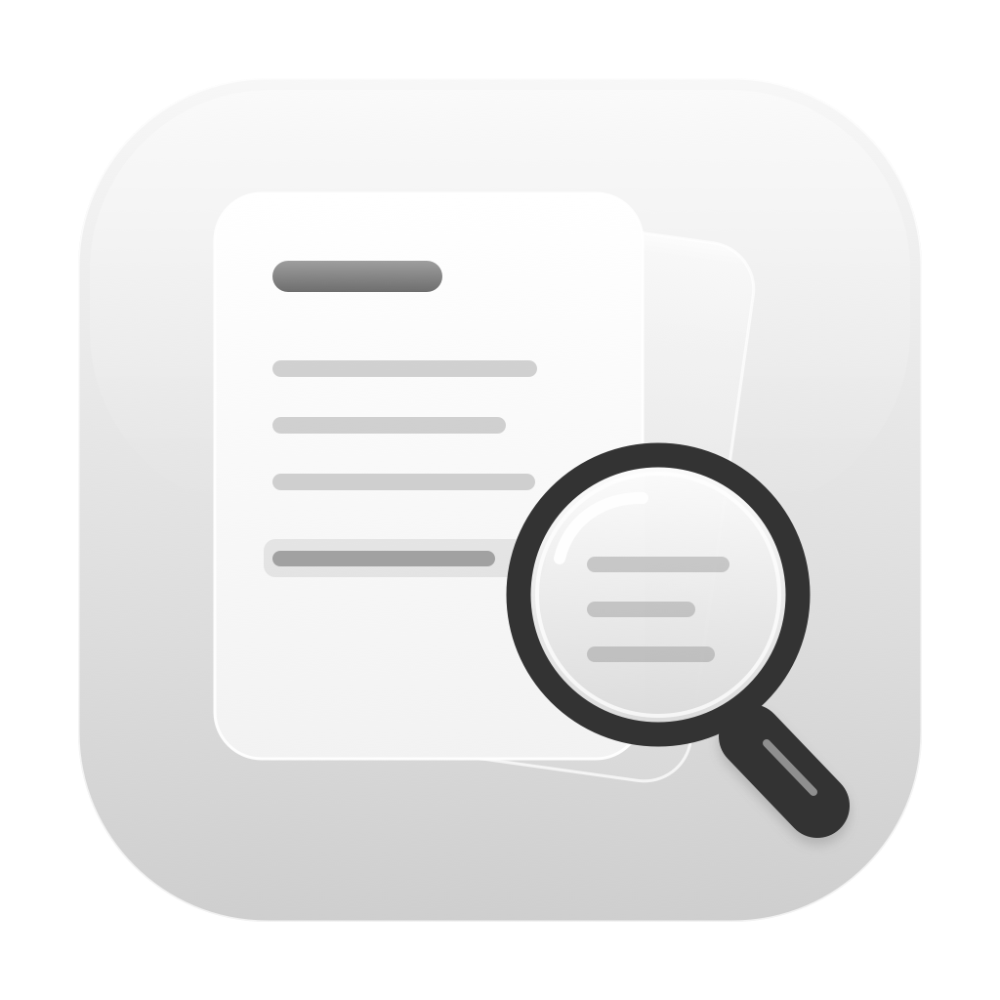
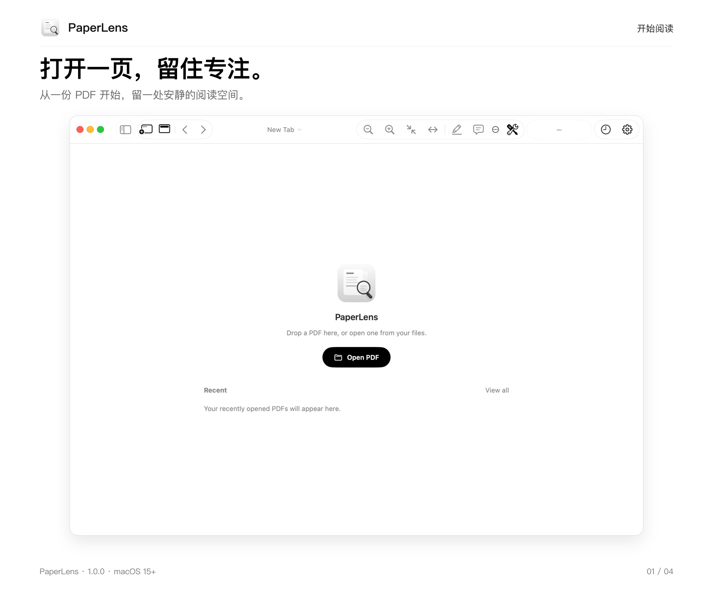
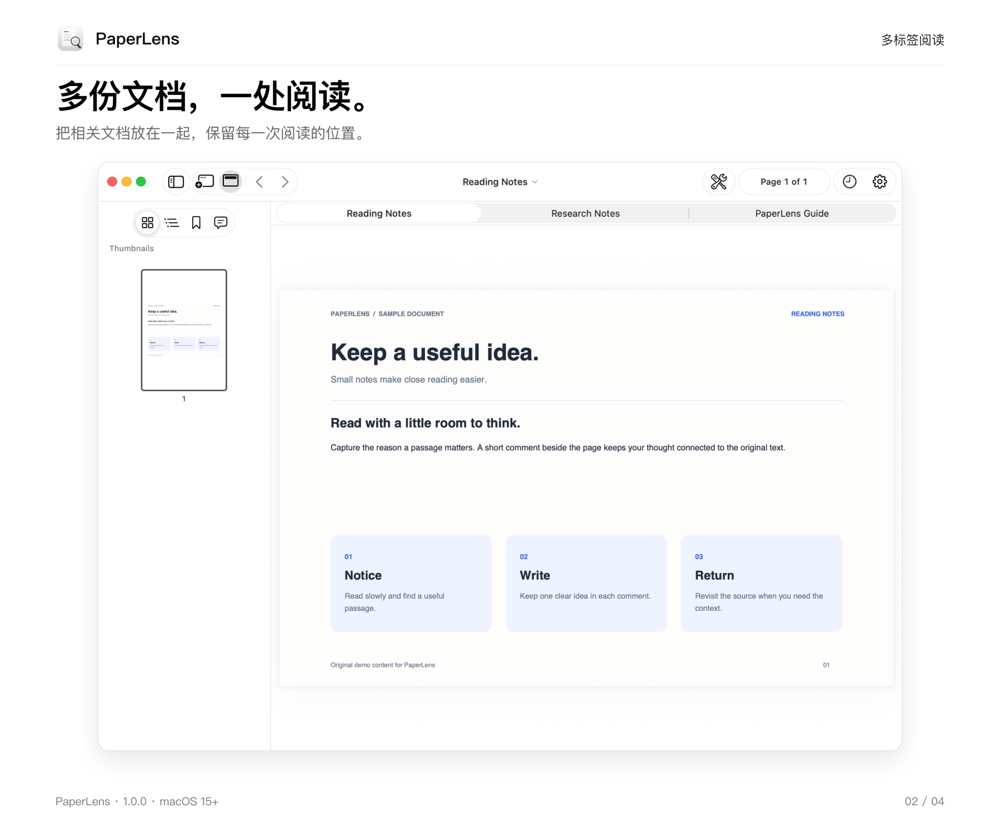
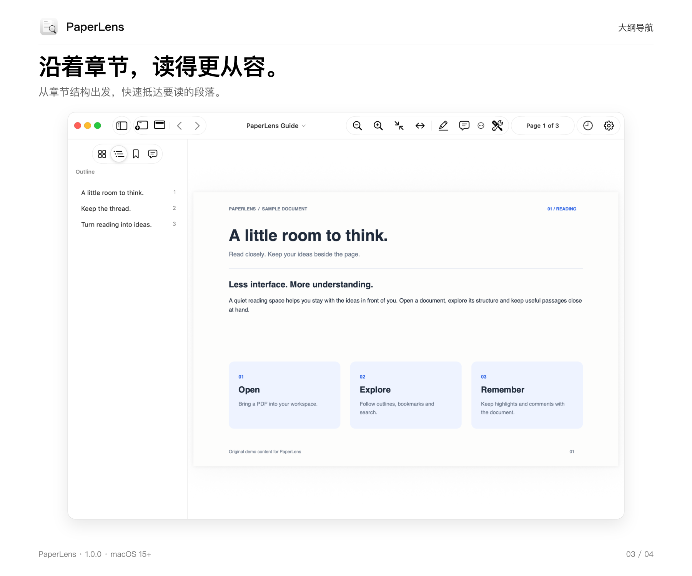
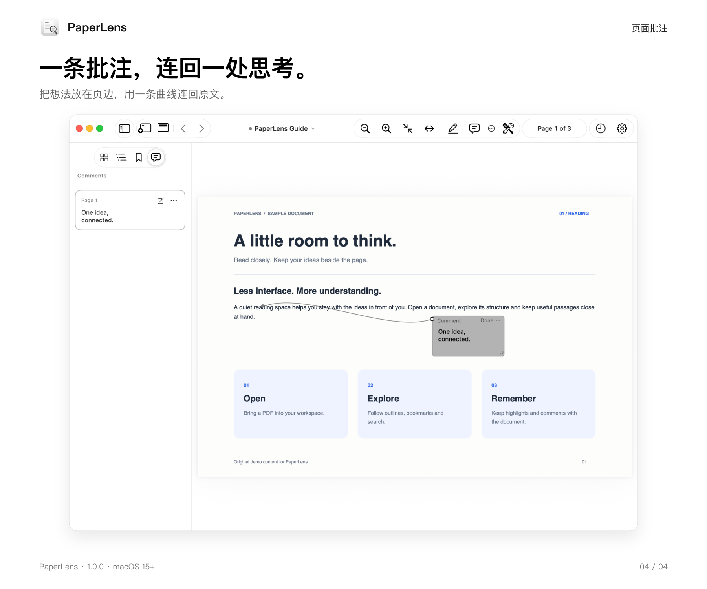

<p align="center">
  
</p>

# PaperLens

一个简洁的原生 macOS PDF 阅读器，支持多标签阅读、高亮、评论和书签，让文档与阅读时的想法保持在一起。

**Version 1.0.0** · macOS 15+ · Apple Silicon

[下载 1.0.0](https://github.com/YoungDrifter/PaperLens/releases/tag/v1.0.0)









## 功能

- 多标签与多窗口阅读，保留每份文档的阅读位置和缩放状态。
- 缩略图、大纲、书签和文内搜索，方便定位长文档。
- PDF 缩放、Fit Page 和 Fit Width，适应不同阅读场景。
- 文本高亮和页面批注；标记与评论卡片可独立移动，以曲线连接，批注布局随 PDF 保存。
- 页面旋转、排序、复制和删除，支持撤销。
- 独立标签栏可按需显示或隐藏，工具栏支持收起；点击顶栏文件名可重命名并设置 Finder 标签。
- 持续高亮与批注模式，支持自定义颜色、下划线和中划线。
- 统一的分类设置界面，包含批注配色、快捷键、插件入口与应用信息。
- 每天自动检查 GitHub 正式版；有更新时在应用内提示、下载并安装，也可从应用菜单或 About 手动检查。

## 安装

从 [Releases](https://github.com/YoungDrifter/PaperLens/releases/tag/v1.0.0) 下载 `PaperLens-1.0.0.dmg`，打开后将 **PaperLens.app** 拖入 **Applications**。`SHA256SUMS.txt` 提供安装包校验值。

当前版本使用 ad-hoc 签名，尚未经过 Apple 公证。

## 版本记录

### 1.0.0 · 首次发布

首次发布，支持多标签 PDF 阅读、导航与搜索、持续标注模式、页面批注、文件管理和可撤销的页面编辑。

[版本介绍与演示](docs/versions/1.0.0/README.md) · [下载 1.0.0](https://github.com/YoungDrifter/PaperLens/releases/tag/v1.0.0)

## 本地构建

安装 Xcode 后，在项目根目录运行：

```sh
xcodebuild -project PaperLens.xcodeproj -scheme PaperLens -configuration Debug build
```

使用 Xcode 打开 `PaperLens.xcodeproj` 进行开发。正式安装包由发布脚本生成，并包含校验文件和签名更新清单。

## 许可证

本项目采用 [MIT License](LICENSE)，允许使用、修改、分发和商业使用，请保留版权及许可证声明。软件按原样提供，不附带任何担保。

## 反馈与贡献

欢迎通过 [Issues](https://github.com/YoungDrifter/PaperLens/issues) 报告问题或提出建议，也欢迎提交 Pull Request。报告问题时请附上 macOS 版本、应用版本和复现步骤；较大的改动请先开 Issue 讨论。

这是个人维护的项目，按作者的时间与需求持续改进，不承诺固定更新频率或响应时间。
